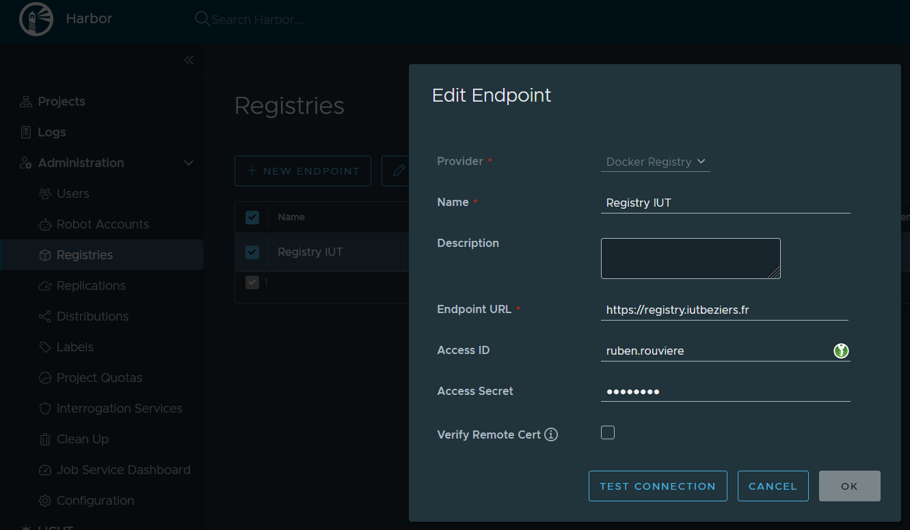
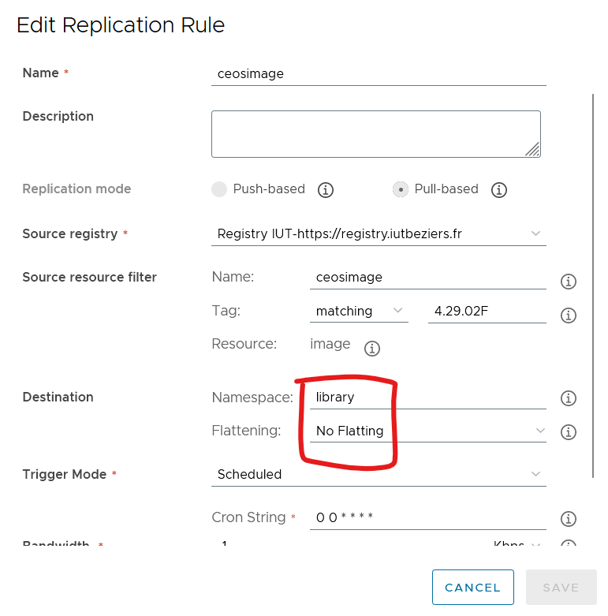

Harbor ne proposant pas de fichier docker compose simple, on utilise l'installateur recommendé dans la documentation: https://goharbor.io/docs/2.7.0/install-config/download-installer/

```bash
wget https://github.com/goharbor/harbor/releases/download/v2.11.0/harbor-online-installer-v2.11.0.tgz
tar xzvf harbor-online-installer-v2.11.0.tgz
```

## Certificats
### Génération du certificat autosigné

```bash
openssl genrsa -out ca.key 4096
docker pull registry.rar.test/ceosimage
openssl req -x509 -new -nodes -sha512 -days 3650 -subj "/C=FR/ST=Beziers/L=Occitanie/O=IUT/OU=RAR/CN=registry.rar.test" -key ca.key -out ca.crt
openssl genrsa -out registry.rar.test.key 4096
openssl req -sha512 -new -subj "/C=FR/ST=Beziers/L=Occitanie/O=IUT/OU=RAR/CN=registry.rar.test" -key registry.rar.test.key -out registry.rar.test.csr
cat v3.ext << EOF
authorityKeyIdentifier=keyid,issuer
basicConstraints=CA:FALSE
keyUsage = digitalSignature, nonRepudiation, keyEncipherment, dataEncipherment
extendedKeyUsage = serverAuth
subjectAltName = @alt_names

[alt_names]
DNS.1=registry.rar.test
DNS.2=registry.rar
DNS.3=registry
EOF
openssl x509 -req -sha512 -days 3650 -extfile v3.ext -CA ca.crt -CAkey ca.key -CAcreateserial -in registry.rar.test.csr -out registry.rar.test.crt
openssl x509 -inform PEM -in registry.rar.test.crt -out registry.rar.test.cert
```

### Ajout du certificat au docker trust store.

Note: cette étape ne semble pas fonctionner. On contourne avec le system trust store.

```bash
cp ca.crt /etc/docker/certs.d/
cp registry.rar.test.{crt,key} /etc/docker/certs.d/
systemctl restart docker

```

## Ajout du certifcat au system trust store

Note: cette étape ne fonctionne également pas. On contourne en last-ressort avec un insecure-registry.

```bash
cp ca.crt /usr/local/share/ca-certificates/rar.crt && update-ca-certificates
systemctl restart docker
```

## Insecure registry

Dans ``/etc/docker/daemon.json``

```json
{
	"insecure-registries": [ "registry.rar.test" ]
}
```

On redémarre le daemon docker.

## Installation d'Harbor

```bash
./prepare
./install.sh

```

## Synchronisation depuis le registry de l'IUT

On ajoute le repository de l'IUT:


### Pull de l'image CEOS

On configure une réplication planifiée de l'image CEOS.

Note: on ne réplique que le tag 4.29.02F dans le cadre de la SAE.

A noter: Harbor "flatten" les images répliqués, mais ne gère pas le cas où l'image est à la racine du repository.
Il est donc nécessaire de préciser dans la configuration de réplication le namespace "library", et de désactiver l'option de flattening.



## Configuration des hotes docker

Dans ``/etc/docker/daemon.json``

```json
{
	"insecure-registries": [ "registry.rar.test" ]
}
```

```bash
resolvectl dns eth0 172.16.6.51
```


